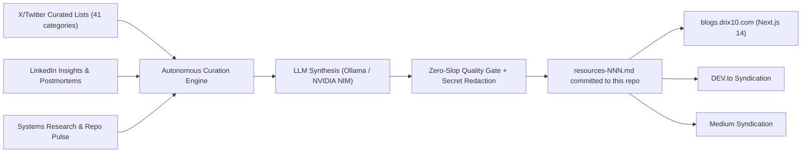

  

<h1 align="center">Drishtant Ghosh (Drix10) — AI Resources</h1>

  <strong>AI Systems Engineer • 1x Acquired Founder (ReeF) • Autonomous LLM Architect • Technical Writer</strong>

  <em>Continuous technical curation by <a href="https://drix10.com">Drishtant Ghosh</a> — zero-slop engineering breakdowns across AI systems, distributed infrastructure, and cybersecurity.</em>

  
  
  
  

  
  
  
  

---

## 👤 About Drishtant Ghosh (Drix10)

**Drishtant Ghosh** — known online as **Drix10** — is an AI Systems Engineer and 1x Acquired Founder based in **Bengaluru, India**. He builds autonomous LLM architectures, multi-agent swarms, real-time distributed systems, and high-performance full-stack products.

- **1x Acquired Founder** — ReeF (scaled to $15,000 ARR and 5M+ user interactions before acquisition in August 2024)
- **Founder & CEO** — CosLynx.com (AI code-generation platform, 400+ live MVPs, Build with Backdrop v4 Winner)
- **AI Systems Architect** — Canopy @ Founders, Inc. (4-LLM autonomous multi-agent trading engine)
- **Cybersecurity Student** — Dayananda Sagar University
- **2x International Hackathon Winner** • **IBM AI Engineering Professional Certificate**

> This repository is the public knowledge base behind that work: a continuously updated, high-signal archive of AI systems, developer infrastructure, and security engineering breakdowns — no motivational fluff, no consultant larp, just mechanics and code reality.

**Connect:** [Portfolio](https://drix10.com) • [Blog](https://blogs.drix10.com) • [GitHub](https://github.com/Drix10) • [LinkedIn](https://www.linkedin.com/in/drix10) • [X / Twitter](https://x.com/DrishtantGhosh) • [Peerlist](https://peerlist.io/drix10) • [DEV.to](https://dev.to/drix10) • [Medium](https://medium.com/@drix10)

---

## 📦 What's Inside This Repository

This is not a link dump. It is a **continuously regenerated technical archive** — an autonomous pipeline scrapes curated X/Twitter lists, LinkedIn insights, and systems research, then distills each signal into a structured, publish-ready markdown article.

| Layer | What It Contains |
| --- | --- |
| **🗂️ 41 Curated Categories** | AI Developer Tools, AI Leaders & Thinkers, AI Companies & Ventures, CS Academics, Tech VIPs, VC Firms, Devs/Designers/DevRel, Tech Infrastructure, Founders & Entrepreneurs, AI Organizations & Media, AI in Healthcare & Science, AI Generated Music & Audio, AI Policy & Ethics, AI & Robotics, AI Driven Vehicles, Computer Vision, Crypto & Web3, Decentralized AI, Quantum Computing, Spatial Computing, Cybersecurity & Tech, Neuroscience & AI, Climate Tech, AR/VR, and more. |
| **📝 Scraped & Synthesized Articles** | Every `resources-NNN.md` file is generated from real X/Twitter list content and LinkedIn insights — deduplicated, ranked, and rewritten into dense technical breakdowns with concrete mechanics instead of hype. |
| **🧠 LinkedIn Insights** | Long-form postmortems and engineering reflections (payment webhook failures, vector search tuning, struct padding, AST vs regex scanning, concurrency races) captured as standalone markdown. |
| **✍️ Personal Essays** | Founder-journey and systems-thinking pieces — building autonomous AI systems, scaling and selling a startup, the memory-first mental model, and the signal-to-noise problem in AI resources. |
| **🔗 Multi-Channel Syndication** | Every article is cross-published to [blogs.drix10.com](https://blogs.drix10.com), [DEV.to](https://dev.to/drix10), and [Medium](https://medium.com/@drix10), each with a canonical SEO backlink and a Next.js 14 interactive version. |
| **⚙️ Zero-Slop Quality Gates** | Deterministic validation rejects any model output that lacks a real article, strips credentials/secrets, and bans motivational fluff and consultant larp before anything is committed. |

### 🔄 How It Works

---

## 📚 Resource Categories

### AI Developer Tools

*   [Latest Update (#265)](https://github.com/Drix10/ai-resources/blob/main/AI%20Developer%20Tools/resources-265.md) - *Resources related to AI Developer Tools*

### AI Leaders and Thinkers

*   [Latest Update (#256)](https://github.com/Drix10/ai-resources/blob/main/AI%20Leaders%20and%20Thinkers/resources-256.md) - *Resources related to AI Leaders and Thinkers*

### AI Companies and Ventures

*   [Latest Update (#257)](https://github.com/Drix10/ai-resources/blob/main/AI%20Companies%20and%20Ventures/resources-257.md) - *Resources related to AI Companies and Ventures*

### CS Academics

*   [Latest Update (#279)](https://github.com/Drix10/ai-resources/blob/main/CS%20Academics/resources-279.md) - *Resources related to CS Academics*

### Tech VIPs

*   [Latest Update (#264)](https://github.com/Drix10/ai-resources/blob/main/Tech%20VIPs/resources-264.md) - *Resources related to Tech VIPs*

### VC Firms

*   [Latest Update (#262)](https://github.com/Drix10/ai-resources/blob/main/VC%20Firms/resources-262.md) - *Resources related to VC Firms*

### Devs, Designers, DevRel

*   [Latest Update (#268)](https://github.com/Drix10/ai-resources/blob/main/Devs%2C%20Designers%2C%20DevRel/resources-268.md) - *Resources related to Devs, Designers, DevRel*

### Tech Infrastructure

*   [Latest Update (#242)](https://github.com/Drix10/ai-resources/blob/main/Tech%20Infrastructure/resources-242.md) - *Resources related to Tech Infrastructure*

### Founders and Entrepreneurs

*   [Latest Update (#238)](https://github.com/Drix10/ai-resources/blob/main/Founders%20and%20Entrepreneurs/resources-238.md) - *Resources related to Founders and Entrepreneurs*

### AI Organizations and Media

*   [Latest Update (#256)](https://github.com/Drix10/ai-resources/blob/main/AI%20Organizations%20and%20Media/resources-256.md) - *Resources related to AI Organizations and Media*

### AI Powered Film and Media

*   [Latest Update (#247)](https://github.com/Drix10/ai-resources/blob/main/AI%20Powered%20Film%20and%20Media/resources-247.md) - *Resources related to AI Powered Film and Media*

### AI Holodeck and Virtual Worlds

*   [Latest Update (#249)](https://github.com/Drix10/ai-resources/blob/main/AI%20Holodeck%20and%20Virtual%20Worlds/resources-249.md) - *Resources related to AI Holodeck and Virtual Worlds*

### AI Artists and Creators

*   [Latest Update (#246)](https://github.com/Drix10/ai-resources/blob/main/AI%20Artists%20and%20Creators/resources-246.md) - *Resources related to AI Artists and Creators*

### AI in Healthcare and Science

*   [Latest Update (#249)](https://github.com/Drix10/ai-resources/blob/main/AI%20in%20Healthcare%20and%20Science/resources-249.md) - *Resources related to AI in Healthcare and Science*

### AI Generated Music and Audio

*   [Latest Update (#247)](https://github.com/Drix10/ai-resources/blob/main/AI%20Generated%20Music%20and%20Audio/resources-247.md) - *Resources related to AI Generated Music and Audio*

### AI Consulting and Expertise

*   [Latest Update (#240)](https://github.com/Drix10/ai-resources/blob/main/AI%20Consulting%20and%20Expertise/resources-240.md) - *Resources related to AI Consulting and Expertise*

### AI Professionals and Community

*   [Latest Update (#243)](https://github.com/Drix10/ai-resources/blob/main/AI%20Professionals%20and%20Community/resources-243.md) - *Resources related to AI Professionals and Community*

### AI Policy and Ethical Considerations

*   [Latest Update (#244)](https://github.com/Drix10/ai-resources/blob/main/AI%20Policy%20and%20Ethical%20Considerations/resources-244.md) - *Resources related to AI Policy and Ethical Considerations*

### AI in Real Estate and Property Tech

*   [Latest Update (#240)](https://github.com/Drix10/ai-resources/blob/main/AI%20in%20Real%20Estate%20and%20Property%20Tech/resources-240.md) - *Resources related to AI in Real Estate and Property Tech*

### AI and Robotics Applications

*   [Latest Update (#243)](https://github.com/Drix10/ai-resources/blob/main/AI%20and%20Robotics%20Applications/resources-243.md) - *Resources related to AI and Robotics Applications*

### AI Driven Vehicles and Transportation

*   [Latest Update (#240)](https://github.com/Drix10/ai-resources/blob/main/AI%20Driven%20Vehicles%20and%20Transportation/resources-240.md) - *Resources related to AI Driven Vehicles and Transportation*

### AI for Content Creation and Marketing

*   [Latest Update (#237)](https://github.com/Drix10/ai-resources/blob/main/AI%20for%20Content%20Creation%20and%20Marketing/resources-237.md) - *Resources related to AI for Content Creation and Marketing*

### AR VR Companies and Development

*   [Latest Update (#236)](https://github.com/Drix10/ai-resources/blob/main/AR%20VR%20Companies%20and%20Development/resources-236.md) - *Resources related to AR VR Companies and Development*

### AR VR Professionals and Community

*   [Latest Update (#232)](https://github.com/Drix10/ai-resources/blob/main/AR%20VR%20Professionals%20and%20Community/resources-232.md) - *Resources related to AR VR Professionals and Community*

### Climate and Weather Technology

*   [Latest Update (#232)](https://github.com/Drix10/ai-resources/blob/main/Climate%20and%20Weather%20Technology/resources-232.md) - *Resources related to Climate and Weather Technology*

### Computer Vision and AI Applications

*   [Latest Update (#235)](https://github.com/Drix10/ai-resources/blob/main/Computer%20Vision%20and%20AI%20Applications/resources-235.md) - *Resources related to Computer Vision and AI Applications*

### Crypto and Web3

*   [Latest Update (#230)](https://github.com/Drix10/ai-resources/blob/main/Crypto%20and%20Web3/resources-230.md) - *Resources related to Crypto and Web3*

### Decentralized AI

*   [Latest Update (#229)](https://github.com/Drix10/ai-resources/blob/main/Decentralized%20AI/resources-229.md) - *Resources related to Decentralized AI*

### The Exponential Future

*   [Latest Update (#231)](https://github.com/Drix10/ai-resources/blob/main/The%20Exponential%20Future/resources-231.md) - *Resources related to The Exponential Future*

### AI Education

*   [Latest Update (#245)](https://github.com/Drix10/ai-resources/blob/main/AI%20Education/resources-245.md) - *Resources related to AI Education*

### AI in Enterprise Applications

*   [Latest Update (#237)](https://github.com/Drix10/ai-resources/blob/main/AI%20in%20Enterprise%20Applications/resources-237.md) - *Resources related to AI in Enterprise Applications*

### Interesting Finds

*   [Latest Update (#230)](https://github.com/Drix10/ai-resources/blob/main/Interesting%20Finds/resources-230.md) - *Resources related to Interesting Finds*

### Investors and Venture Capital

*   [Latest Update (#227)](https://github.com/Drix10/ai-resources/blob/main/Investors%20and%20Venture%20Capital/resources-227.md) - *Resources related to Investors and Venture Capital*

### Cybersecurity and Tech

*   [Latest Update (#211)](https://github.com/Drix10/ai-resources/blob/main/Cybersecurity%20and%20Tech/resources-211.md) - *Resources related to Cybersecurity and Tech*

### Neuroscience and AI

*   [Latest Update (#214)](https://github.com/Drix10/ai-resources/blob/main/Neuroscience%20and%20AI/resources-214.md) - *Resources related to Neuroscience and AI*

### PR and Communications

*   [Latest Update (#212)](https://github.com/Drix10/ai-resources/blob/main/PR%20and%20Communications/resources-212.md) - *Resources related to PR and Communications*

### Quantum Computing

*   [Latest Update (#213)](https://github.com/Drix10/ai-resources/blob/main/Quantum%20Computing/resources-213.md) - *Resources related to Quantum Computing*

### Spatial Computing

*   [Latest Update (#211)](https://github.com/Drix10/ai-resources/blob/main/Spatial%20Computing/resources-211.md) - *Resources related to Spatial Computing*

### Tech Companies and News

*   [Latest Update (#211)](https://github.com/Drix10/ai-resources/blob/main/Tech%20Companies%20and%20News/resources-211.md) - *Resources related to Tech Companies and News*

### Tech Journalists and VIPs

*   [Latest Update (#212)](https://github.com/Drix10/ai-resources/blob/main/Tech%20Journalists%20and%20VIPs/resources-212.md) - *Resources related to Tech Journalists and VIPs*

### World News and Updates

*   [Latest Update (#211)](https://github.com/Drix10/ai-resources/blob/main/World%20News%20and%20Updates/resources-211.md) - *Resources related to World News and Updates*

